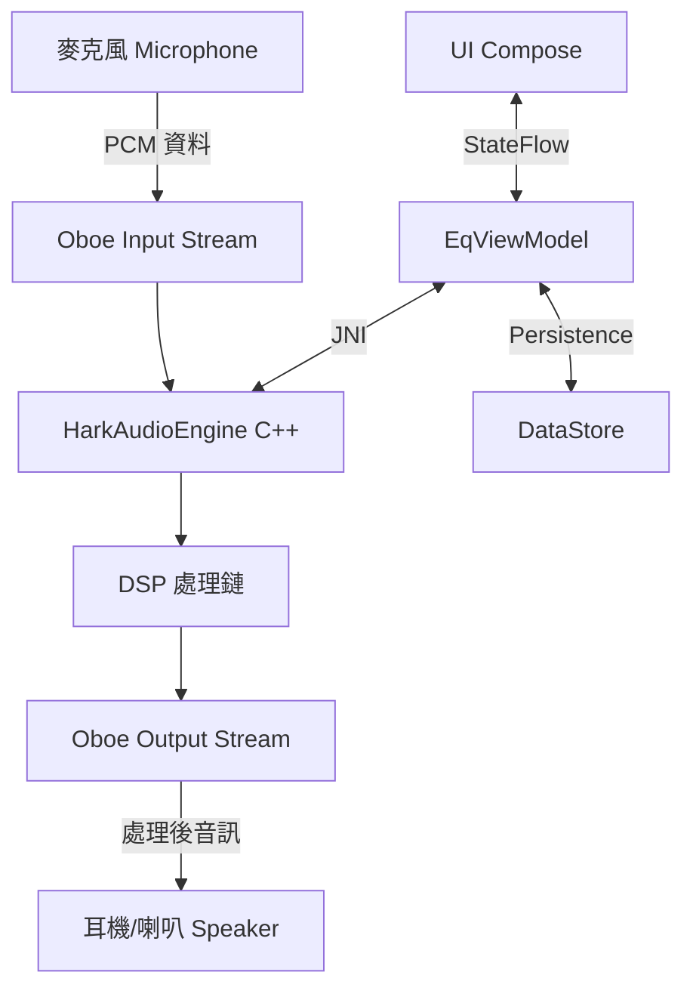
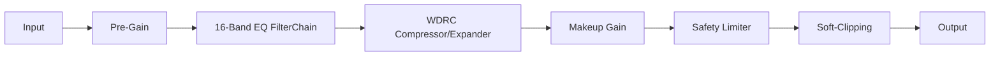
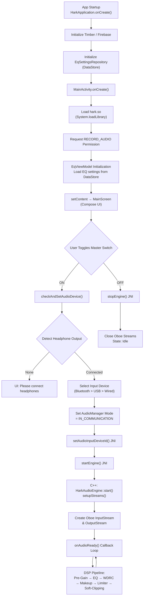

# Hark - 專業助聽器音訊等化器與 DSP 引擎

Hark 是一款專為聽損者設計的高階 Android 助聽應用程式。它結合了實時音訊處理技術 (DSP) 與現代 Android 開發範式，旨在提供低延遲、高保真且符合醫療級標準的聽力輔助體驗。

---

## 1. 專案願景與目標
*   **低延遲處理**：利用 Oboe (C++) 實作實時音訊處理，將延遲降至最低。
*   **醫療級 DSP**：整合 WDRC (寬動態範圍壓縮)、噪音閘門 (Expander) 與自動增益控制 (AGC-O)。
*   **FDA 合規設計**：遵循美國 FDA 對 OTC 助聽器的安全性要求，具備軟削波 (Soft-Clipping) 與輸出限制。
*   **極簡現代 UI**：使用 Jetpack Compose 打造流暢且直覺的 16 段等化器控制介面。

---

## 2. 專案目錄結構 (Project Structure)

```text
Hark/
├── app/src/main/
│   ├── cpp/ (原生音訊引擎 - C++)
│   │   ├── HarkAudioEngine.{h,cpp}    # 核心引擎 (Oboe 管理與處理鏈)
│   │   ├── DynamicsProcessor.{h,cpp}  # 動態處理 (WDRC, Expander, Limiter)
│   │   ├── FilterChain.{h,cpp}       # 濾波器組管理 (16-band EQ)
│   │   ├── BiquadFilter.{h,cpp}      # 雙二階濾波器基礎邏輯
│   │   └── native-lib.cpp            # JNI 橋接層
│   ├── java/com/wcy/hark/ (App 邏輯 - Kotlin)
│   │   ├── MainActivity.kt           # 程式入口與權限管理
│   │   ├── HarkApplication.kt        # 初始化 Firebase 與 DI
│   │   ├── EqViewModel.kt            # 業務邏輯與狀態管理
│   │   ├── audio/
│   │   │   ├── AudioDeviceManager.kt # 藍牙 SCO 與音訊路由控制
│   │   │   └── HarkAudioBridge.kt    # JNI 封裝類別
│   │   ├── data/
│   │   │   └── EqSettingsRepository.kt# 等化器參數持久化 (DataStore)
│   │   └── ui/
│   │       ├── screen/MainScreen.kt  # 主介面 UI
│   │       └── components/           # 自定義 UI 元件
└── README.md
```

---

## 3. 系統流程圖 (System Architecture)

### 總體資料流 (Overall Data Flow)


### DSP 處理鏈邏輯 (DSP Pipeline)


### 執行生命週期 (App Execution Flow)


---

## 4. 關鍵模組介紹

### 原生引擎層 (C++ / NDK)
*   **HarkAudioEngine**:
    - 負責 Oboe 串流的生命週期（開啟、暫停、重啟）。
    - 實作 `onAudioReady` 回調，執行實時音訊處理循環。
    - **AGC-O 策略**：根據 EQ 增益自動預留 Headroom，防止數位破音。
*   **DynamicsProcessor**:
    - **WDRC**：提供針對不同聽力閾值的非線性壓縮。
    - **Expander (Noise Gate)**：抑制低於門檻值的環境噪音（解決「瀑布聲」）。
    - **Soft-Knee**：平滑的壓縮過渡，提升聽感自然度。
*   **FilterChain & BiquadFilter**:
    - 串聯 16 組雙二階濾波器。
    - 支持 Peaking、Low-Shelf、High-Shelf 等多種濾波類型。

### 應用程式層 (Kotlin / Compose)
*   **EqViewModel**:
    - 使用 `StateFlow` 管理 16 段增益值。
    - 確保 UI 更新與底層 DSP 參數變更同步。
*   **AudioDeviceManager**:
    - 處理 Android 複雜的藍牙 SCO 路由切換。
    - 確保在藍牙連接後自動重啟引擎。
*   **MainScreen**:
    - 提供可視化的頻率響應曲線與系統音量同步控制。

---

## 5. 技術棧 (Tech Stack)

*   **語言**: Kotlin (UI/邏輯) & C++ (DSP 引擎)
*   **音訊 API**: **Oboe** (AAudio & OpenSL ES 封裝)
*   **介面框架**: Jetpack Compose
*   **架構**: MVVM (ViewModel + Repository)
*   **監測工具**: Firebase Analytics & Crashlytics

---

## 6. 使用與測試
1.  開啟 App 後，請授予「麥克風」權限。
2.  連接藍牙耳機，系統會自動切換至助聽模式。
3.  調整 16 段等化器以補償特定頻段的聽力損失。
4.  按下「重設」可恢復至「通透模式」。

## DSP 參數與設計

詳細的 DSP 設計參數（壓縮曲線、Attack/Release、MPO/Limiter、signal chain、驗證步驟）請參考 [docs/DSP_PARAMETERS.md](docs/DSP_PARAMETERS.md).

---

## 7. 聯絡與支援
如有任何問題或改進建議，歡迎提交 Issue。
