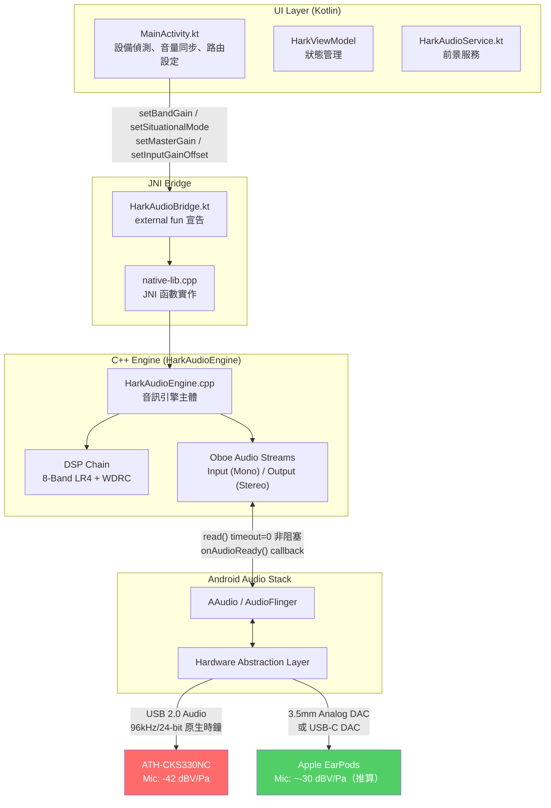
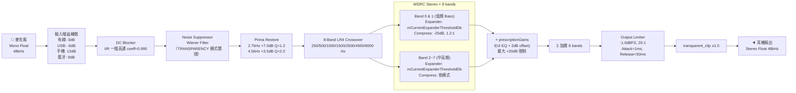
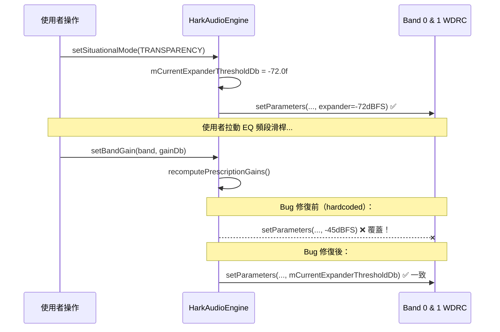
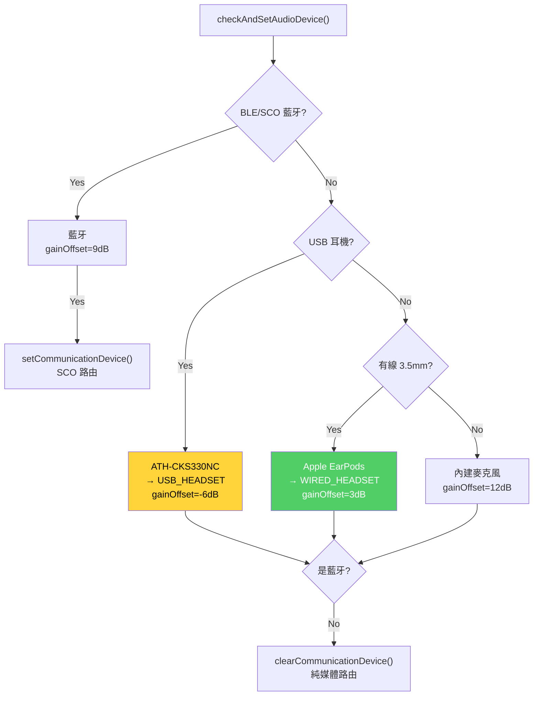

# Hark Audio Engine — 完整架構與 DSP 優化分析

> 文件版本：2026-06-15 (v4.6)
> 對應程式碼版本：動態 Auto-Headroom 與語音 WDRC 放寬優化後

---

## 1. 系統整體架構（Kotlin ↔ JNI ↔ C++）

---

## 2. 完整 DSP 訊號鏈（每個 Sample 的處理流程）

---

## 3. 麥克風靈敏度與訊號位準對比

| | ATH-CKS330NC | Apple EarPods |
|---|---|---|
| 麥克風靈敏度 | **-42 dBV/Pa**（規格書） | **~-30 dBV/Pa**（推算） |
| 靈敏度差距 | 比 Apple 弱 **12 dB** | 基準 |
| 65 dBSPL 麥克風輸出 | -71 dBFS | -59 dBFS |
| + inputGainOffset 9dB | **-62 dBFS** | **-50 dBFS** |
| TRANSPARENCY expander (-72dB) | -62 > -72 → ✅ 通過 | -50 > -72 → ✅ 通過 |
| **Bug時** Band 0 expander (-45dB) | -62 < -45 → ❌ 衰減 93% | -50 < -45 → 衰減 44% |
| **Bug時** Band 1 expander (-50dB) | -62 < -50 → ❌ 衰減 87% | -50 ≈ -50 → 幾乎不衰減 ✅ |

---

## 4. WDRC Expander 覆蓋 Bug（根本原因與修復）

---

## 5. WDRC 各模式參數一覽

| 模式 | Compress Threshold | Compress Ratio | Attack | Release | Base Expander Threshold | Base Expander Ratio |
|---|---|---|---|---|---|---|
| TRANSPARENCY | -20 dBFS | 1.2:1 | 10 ms | 600 ms | -60 dBFS | 2.5:1 (0.4f) |
| CONVERSATION | -30 dBFS | 1.5:1 | 5 ms | 200 ms | -40 dBFS | 4:1 (0.25f) |
| OUTDOOR | -25 dBFS | 1.3:1 | 5 ms | 200 ms | -40 dBFS | 4:1 (0.25f) |
| CINEMA | -15 dBFS | 1.1:1 | 20 ms | 600 ms | -65 dBFS | 2.5:1 (0.4f) |

### ⚠️ WDRC 頻帶特異性優化 (v4.6 引入)

為了兼顧弱麥克風（如 AirPods/CKS330）的**語音可懂度**與大聲輸入（如 Pixel 9 內建麥克風）的**防破音**保護，系統對不同頻帶進行了特異性處理：
1. **核心語音頻帶 (Bands 2-5, 500Hz - 4kHz)**: Expander 門檻固定強制放寬至 `-55 dBFS`，比例降低為 `1.5:1` (`0.66f` linear)，使微弱的子音不會被當作噪音切除，保留語音清晰度。
2. **低頻與高頻頻帶 (Bands 0, 1, 7)**: 套用特殊高門檻壓制。例如 Band 0 門檻設為 `-32dBFS`，Band 1 設為 `-35dBFS`，Band 7 設為 `-36dBFS`，以隔離環境低頻雜訊與麥克風高頻 Hiss 聲。

### ⚡ 電平相關的動態 Auto-Headroom (v4.6 引入)

系統在音訊執行緒中實時追蹤輸入的 slow-moving RMS (`mInputRmsSlow`)：
* 當輸入電平低於 `-45 dBFS` 時，Headroom 衰減為 **0 dB**，使安靜環境下獲得最大語音增益。
* 當輸入電平高於 `-20 dBFS` 時，Headroom 衰減為 **100% 正常值**，以防止過載削波。
* 在 `-45 dBFS` 到 `-20 dBFS` 之間進行線性插值過渡。
* 處方增益基礎位移從 `+3.0 dB` 調升至 `+8.0 dB`，以提供更充足的助聽增益。

---

## 6. 裝置偵測與通訊路由決策

---

## 7. 已知問題追蹤

| # | 問題描述 | 狀態 |
|---|---|---|
| 1 | 執行緒超時（1ms deadline miss） | ✅ 修復：非阻塞 read(timeout=0) |
| 2 | 啟動時 WouldBlock 斷斷續續 | ✅ 修復：30ms duplex pre-buffering |
| 3 | 系統 AGC 音量抽吸（有線耳機） | ✅ 修復：clearCommunicationDevice() |
| 4 | DSP 雙重衰減（masterGain × DAC） | ✅ 修復：masterGain 固定 1.0f |
| 5 | ATH-CKS330NC Band 0/1 expander 覆蓋 Bug | ✅ 修復：mCurrentExpanderThresholdDb |
| 6 | Limiter 0ms attack 導致完全靜音 | ✅ 修復：attack=1ms, ratio=20:1 |
| 7 | Kotlin deprecated Bluetooth SCO API | ⚠️ 待修：目前功能正常 |

---

## 8. 關鍵設計原則

1. **音訊執行緒絕對非阻塞**：`read()` timeout=0，WouldBlock 以靜音填充
2. **DSP 增益與系統音量解耦**：`masterGain=1.0f` 固定，DAC 音量僅由系統音量控制
3. **通訊路由僅限藍牙**：有線/USB 耳機使用純媒體路由，避免系統 AGC 干擾
4. **WDRC 狀態一致性**：`mCurrentExpanderThresholdDb` 作為 Single Source of Truth
5. **依硬體規格校準**：inputGainOffset 根據麥克風 dBV/Pa 規格計算
