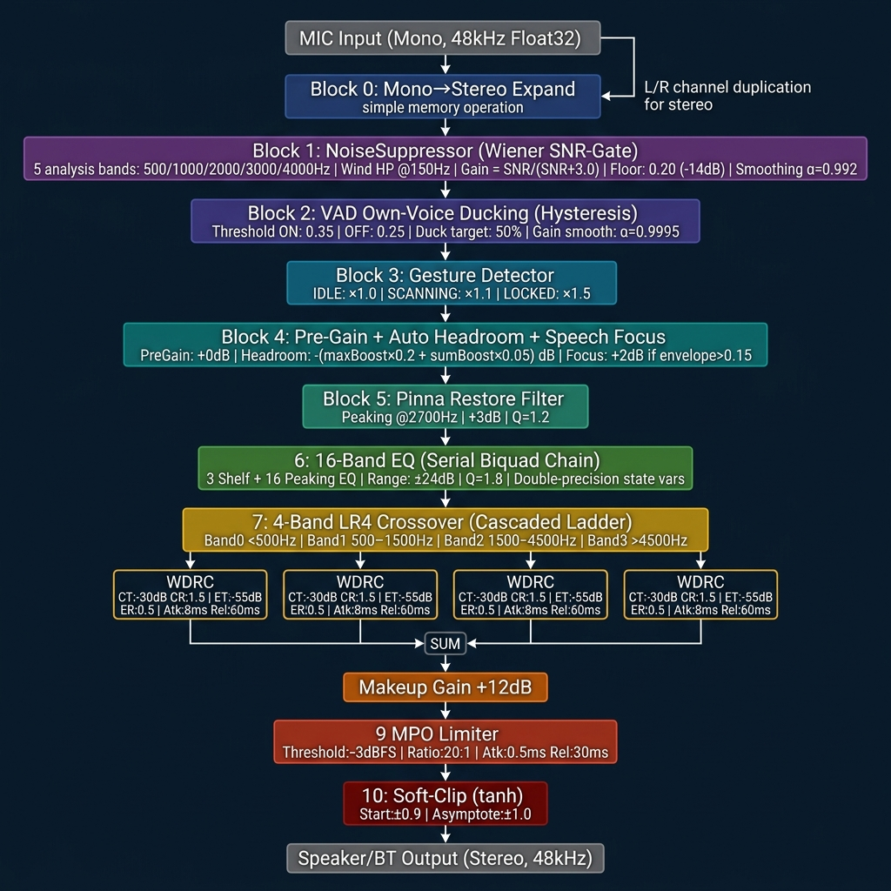
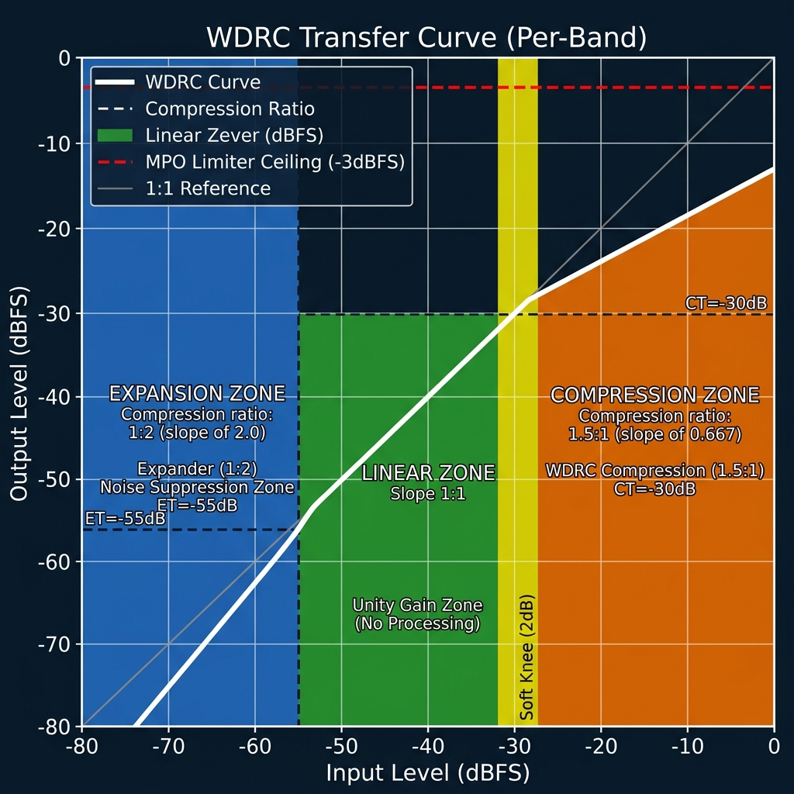
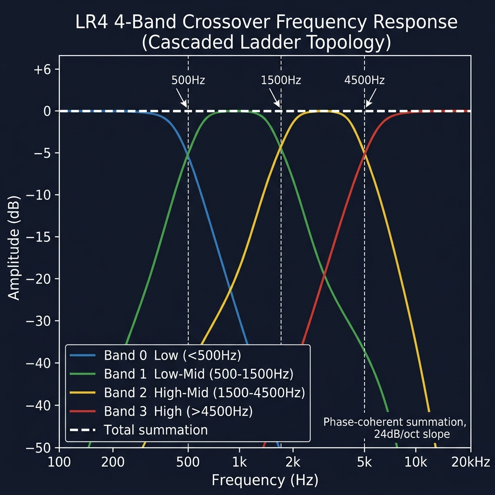

# Hark DSP 即時音訊處理完整設計文件

**版本**: v3.0 (2026-05-14 穩定版)  
**最後更新**: 2026-05-14  
**專案**: Hark — 助聽器 DSP Android App  
**核心引擎**: Google Oboe (48kHz, Float32, Stereo output / Mono input)

---

## 一、完整訊號鏈架構 (Signal Chain Overview)



### 文字版架構（供程式碼審閱）

```
┌─────────────────────────────────────────────────────────────┐
│               MIC Input (Mono, 48kHz, Float32)              │
└─────────────────────────┬───────────────────────────────────┘
                          ▼
┌─────────────────────────────────────────────────────────────┐
│  [0] Mono → Stereo Expand                                   │
│  從後往前原地展開：buffer[i*2]=buffer[i*2+1]=buffer[i]       │
└─────────────────────────┬───────────────────────────────────┘
                          ▼  (以下 L/R 雙聲道對稱處理)
┌─────────────────────────────────────────────────────────────┐
│  [1] NoiseSuppressor — Wiener SNR-Gate                      │
│  ├ 風噪高通：HighPass @150Hz (Q=0.7)                         │
│  ├ 5頻帶分析濾波器：500/1000/2000/3000/4000 Hz              │
│  ├ 能量追蹤：E = 0.98×E_prev + 0.02×|x|                    │
│  ├ 噪音地板：NF = 0.999×NF + 0.001×E (安靜期更新)           │
│  ├ SNR 增益：G = SNR/(SNR+3.0)，底限 0.20 (-14dB)           │
│  ├ 增益平滑：G_smooth = 0.992×G_prev + 0.008×G_target       │
│  └ 中頻語音權重：1k-3kHz 權重 ×2，其他 ×1                   │
└─────────────────────────┬───────────────────────────────────┘
                          ▼
┌─────────────────────────────────────────────────────────────┐
│  [2] VAD Own-Voice Ducking — Hysteresis Gate                │
│  ├ 包絡偵測：E = 0.98×E + 0.02×|x|                         │
│  ├ 啟動門檻：0.35 (-9dBFS)                                  │
│  ├ 解除門檻：0.25 (-12dBFS) [遲滯效應]                      │
│  ├ Ducking 目標：50% (-6dB)                                  │
│  ├ 觸發條件：僅立體聲輸入且相干性 < 0.15                     │
│  └ 增益平滑：α=0.9995（極慢，消除斷續感）                    │
└─────────────────────────┬───────────────────────────────────┘
                          ▼
┌─────────────────────────────────────────────────────────────┐
│  [4] Multi-band WDRC + Prescription Mapping                 │
│  ├ 映射: 16 UI Bands → 8 Internal WDRC Bands                │
│  ├ 增益: UI_Gain + Global_Offset (+3.0dB)                   │
│  ├ 低頻噪音管理: Band 0/1 具有更靈敏的 Expander (-45dB)      │
│  └ 噪音門: 其他頻段 Thres=-60dB, Ratio=0.5                   │
└─────────────────────────┬───────────────────────────────────┘
                          ▼
┌─────────────────────────────────────────────────────────────┐
│  [4] Pre-Gain + Auto Headroom + Auto Speech Focus           │
│  ├ PreGain: +0dB (預設, JNI 可調)                           │
│  ├ AutoHeadroom: -( max(gains)×0.40 + sum(gains)×0.05 ) dB  │
│  │   → 安全上限保護，防止多頻段 EQ 疊加破音                  │
│  └ SpeechFocus: 若 envelope>0.15 且 duckingGain>0.8        │
│      → 額外 +2dB，平滑係數 α=0.999                          │
└─────────────────────────┬───────────────────────────────────┘
                          ▼
┌─────────────────────────────────────────────────────────────┐
│  [2] Dual-Peak Pinna Restore (耳廓補償 v3.0)                  │
│  ├ Peak 1: 2700 Hz, +3dB, Q=1.2                              │
│  └ Peak 2: 4500 Hz, +2dB, Q=1.5                              │
│  ＊補償耳機阻塞效應並強化高頻空間定位感                           │
│  (Legacy v1.0 僅使用 2700Hz 單峰補償)                          │
└─────────────────────────┬───────────────────────────────────┘
                          ▼
┌─────────────────────────────────────────────────────────────┐
│  [6] 16-Band EQ — Serial Biquad FilterChain                 │
│  ├ Band 0-1: LowShelf @200Hz, @300Hz (0dB pass-through)    │
│  ├ Band 2-17: Peaking EQ                                    │
│  │   頻率: 250/315/400/500/630/800/1000/1250/               │
│  │          1600/2000/2500/3150/4000/5000/6300/8000 Hz      │
│  │   增益範圍: ±24dB (UI 可調)                              │
│  │   Q值: 1.8 (寬帶，符合助聽器擬合需求)                    │
│  ├ Band 18: HighShelf @4kHz (0dB pass-through)             │
│  └ 係數/狀態精度: double (64-bit)，防低頻量化雜訊            │
└─────────────────────────┬───────────────────────────────────┘
                          ▼
┌─────────────────────────────────────────────────────────────┐
│  [7] 4-Band LR4 Crossover + Multi-band WDRC                 │
│                                                             │
│  串聯梯形拓撲 (Cascaded Ladder Topology):                   │
│  Input → Xover@500Hz                                        │
│              ├── low  → Band0 (<500Hz)   → WDRC 0          │
│              └── high → Xover@1500Hz                        │
│                            ├── low  → Band1 (500-1500Hz)   │
│                            │          → WDRC 1             │
│                            └── high → Xover@4500Hz          │
│                                         ├── low  → Band2   │
│                                         │   (1500-4500Hz)  │
│                                         │   → WDRC 2       │
│                                         └── high → Band3   │
│                                             (>4500Hz)       │
│                                             → WDRC 3       │
│                       SUM ← ← ← ← ← ← ← ← ←              │
│                                                             │
│  每個 WDRC 參數（相同設定）:                                │
│  CT=-30dB, CR=1.5:1, ET=-100dB (關閉), ER=1.0            │
│  Attack=8ms, Release=300ms                                  │
└─────────────────────────┬───────────────────────────────────┘
                          ▼
┌─────────────────────────────────────────────────────────────┐
│  [8] Makeup Gain: +16dB (預設)                              │
└─────────────────────────┬───────────────────────────────────┘
                          ▼
┌─────────────────────────────────────────────────────────────┐
│  [9] MPO Limiter (Maximum Power Output)                     │
│  ├ Threshold: -1.5dBFS                                        │
│  ├ Ratio: 20:1 (近似硬牆)                                  │
│  ├ Attack: 0.5ms, Release: 30ms                             │
│  └ Expander: 關閉 (ET=-100dB)                              │
└─────────────────────────┬───────────────────────────────────┘
                          ▼
┌─────────────────────────────────────────────────────────────┐
│  [10] Soft-Clip Safety Stage (tanh-based)                   │
│  if |x| > 0.9: out = 0.9 + 0.1×tanh((|x|-0.9)/0.1) × sign │
│  else: pass-through                                         │
└─────────────────────────┬───────────────────────────────────┘
                          ▼
┌─────────────────────────────────────────────────────────────┐
│          Speaker / BT Output (Stereo, 48kHz)               │
└─────────────────────────────────────────────────────────────┘
```

---

## 二、WDRC 動態處理曲線



### 5.1 各情境模式 WDRC 預設參數 (v3.0)

| 模式 | 門檻 (Threshold) | 壓縮比 (Ratio) | Attack (ms) | Release (ms) | 噪音門 (Expander) | NS 強度 |
|:---:|:---:|:---:|:---:|:---:|:---:|:---:|
| **透明 (Transparency)** | -25.0 dB | 1.2 : 1 | 10 ms | 600 ms | -60dB / 0.5 | 輕微 (-6dB) |
| **人聲 (Conversation)** | -35.0 dB | 2.0 : 1 | 5 ms | 300 ms | -50dB / 0.5 | 強力 (-12dB) |
| **戶外 (Outdoor)** | -20.0 dB | 1.5 : 1 | 10 ms | 600 ms | -45dB / 0.4 | 中等 (-9dB) |
| **劇院 (Cinema)** | -22.0 dB | 1.2 : 1 | 15 ms | 800 ms | -65dB / 0.5 | 輕微 (-3dB) |

> **v3.0 變更記錄**:
> - 所有模式均加入了 **Expander (噪音門)** 以解決底噪呼吸效應。
> - **人聲模式** 提升了壓縮比至 2.0，並縮短了 Attack 時間以捕捉瞬態語音。
> - **全域位移**: 所有的處方增益均額外套用了 **+3.0dB** 的偏移（2026-05-14 更新）。

### 時間常數計算（@48kHz）

```
Attack  = 8ms   → coeff = exp(-1/(48000×0.008)) ≈ 0.99740
Release = 60ms  → coeff = exp(-1/(48000×0.060)) ≈ 0.99965

Limiter:
Attack  = 0.5ms → coeff = exp(-1/(48000×0.0005)) ≈ 0.95910
Release = 30ms  → coeff = exp(-1/(48000×0.030)) ≈ 0.99931
```

### Gain 更新機制（DynamicsProcessor 效能優化）

```cpp
// 每 16 個樣本才重新計算一次 log10/pow（浮點運算昂貴）
static const int UPDATE_INTERVAL = 16;

// 增益平滑（0.7/0.3）：快速追蹤但不會產生爆音
mCurrentGain = 0.7f * mCurrentGain + 0.3f * mTargetGain;
```

---

## 三、LR4 分頻網路頻率響應



### LR4 規格

| 屬性 | 值 |
|------|----|
| **類型** | Linkwitz-Riley 4th Order (LR4) |
| **組成** | 2× Butterworth 2nd Order 串聯 |
| **Q 值** | 0.70710678118 (= 1/√2) |
| **斜率** | 24 dB/octave |
| **交叉點增益** | −6dB（單頻段）|
| **加總特性** | 相位一致，合計 = 0dB（平坦）|

### 分頻點

| 交叉器 | 頻率 | 用途 |
|--------|------|------|
| XoverLow | 500 Hz | Band0/Band1+ 分界 |
| XoverMid | 1500 Hz | Band1/Band2+ 分界 |
| XoverHigh | 4500 Hz | Band2/Band3 分界 |

---

## 四、NoiseSuppressor 設計細節

### 架構（Wiener SNR-Weighted Filter Bank）

```
Input
  │
  ├─ [HighPass @150Hz] → 移除風噪與低頻轟鳴
  │
  ├─ [分析濾波器 ×5] → 500/1000/2000/3000/4000Hz
  │      │
  │      ├─ 能量追蹤 E[i] = 0.98×E[i-1] + 0.02×|x|
  │      ├─ 噪音地板 NF[i] = 0.999×NF[i-1] + 0.001×E[i] (安靜時)
  │      ├─ SNR = E[i] / (NF[i] + ε)
  │      └─ G_target = SNR / (SNR + 3.0), floor=0.20
  │
  ├─ 增益平滑 G[i] = 0.992×G[i-1] + 0.008×G_target
  │
  └─ 加權輸出：中頻(1k-3k) weight=1.0，其他 weight=0.5
              finalGain = Σ(G[i]×w[i]) / Σ(w[i])

Output = filteredSample × finalGain
```

### Wiener Filter 抑制因子選擇依據

> ⚠️ **BUG-01 修正 (2026-05-11)**：本表格原記載 factor=3.0，但 `NoiseSuppressor.cpp` 實際使用 `suppressionFactor = 2.0f`。白箱測試發現不一致，已更正。

| SNR | factor=2.0 (當前實作) | 備註 |
|-----|-----------------------|------|
| SNR=0.5 (底噪) | 0.50/2.5=0.20 → floor | 增益底限觸發 |
| SNR=1 (環境音) | 1.0/3.0=0.33 | 約 -9.6dB |
| SNR=3 (弱語音) | 3.0/5.0=0.60 | 約 -4.4dB |
| SNR=5 (清晰語音) | 5.0/7.0=0.71 | 約 -3.0dB |
| SNR=10 (大聲語音) | 10.0/12.0=0.83 | 約 -1.6dB |

---

## 五、Auto-Headroom 演算法

```cpp
// 雙重保護機制
float maxBoostDb = max(所有正值 mBandGains[]);   // 最大單頻段推高
float sumBoostDb = sum(所有正值 mBandGains[]);   // 所有頻段能量累計

// 兩段保護：
// 1. maxBoost×0.40：針對單頻段大幅推高
// 2. sumBoost×0.05：針對多頻段同時推高的累積效應
float headroomDb = -max(0, (maxBoostDb × 0.40) + (sumBoostDb × 0.05));
mAutoHeadroomLinear = 10^(headroomDb / 20);

// 觸發日誌：只有變化超過 0.5dB 才記錄（避免 Logcat spam）
```

### 極端情境測試

| 場景 | maxBoost | sumBoost | headroomDb |
|------|---------|---------|------------|
| 全部 0dB | 0 | 0 | 0dB |
| 1 個頻段 +12dB | 12 | 12 | -5.4dB |
| 1 個頻段 +24dB | 24 | 24 | -10.8dB |
| 8 個頻段 +12dB | 12 | 96 | -9.6dB |
| 全部 16 頻段 +24dB | 24 | 384 | -28.8dB |

---

## 六、Biquad 濾波器精度設計

### 係數計算（Audio EQ Cookbook, RBJ）

```
Peaking EQ:
  A  = 10^(gainDb/40)
  w0 = 2π × f / Fs
  α  = sin(w0) / (2×Q)

  b0 = (1 + α×A),  b1 = -2cos(w0),  b2 = (1 - α×A)
  a0 = (1 + α/A),  a1 = -2cos(w0),  a2 = (1 - α/A)
  → 歸一化: b/=a0, a/=a0

LowPass (用於 LR4):
  b0 = (1-cos(w0))/2,  b1 = 1-cos(w0),  b2 = (1-cos(w0))/2
  a0 = 1+α,  a1 = -2cos(w0),  a2 = 1-α

HighPass (用於 LR4):
  b0 = (1+cos(w0))/2,  b1 = -(1+cos(w0)),  b2 = (1+cos(w0))/2
  a0 = 1+α,  a1 = -2cos(w0),  a2 = 1-α
```

### 精度策略

| 部位 | 型別 | 理由 |
|------|------|------|
| 係數 b0,b1,b2,a1,a2 | `double` | 編譯期計算，無效能損耗 |
| 狀態 x1,x2,y1,y2 | `double` | **關鍵**：防低頻 IIR 截斷誤差 |
| 輸入/輸出樣本 | `float` | 與 Oboe buffer 格式一致 |
| Denormal 防護 | `std::abs(out) < FLT_MIN` → 0 | 防 ARM 效能崩潰 |

---

## 七、安全機制層疊 (Defense in Depth)

```
Layer 1: NoiseSuppressor    → SNR-gate 在最前端清除底噪
Layer 2: Auto-Headroom      → EQ 推高時主動降低總音量
Layer 3: WDRC Expander      → 已關閉 (-100dB)，避免雙重門檻問題
Layer 4: MPO Limiter        → 硬性上限 -1.5dBFS，FDA 保護
Layer 5: Soft-Clip (tanh)   → 數學保證輸出不超過 ±1.0
```

---

## 八、執行緒與鎖定設計

| 情境 | 執行緒 | 保護 |
|------|--------|------|
| `onAudioReady` | Oboe real-time thread | `mDSPMutex` lock_guard |
| `setBandGain` | Kotlin/JNI thread | `mDSPMutex` lock_guard |
| `setWdrcParameters` | Kotlin/JNI thread | `mDSPMutex` lock_guard |
| `onErrorAfterClose` | Oboe error thread | `mDSPMutex` lock_guard |
| `start/stop` | Main thread | N/A (mIsRunning atomic) |

> ⚠️ **注意**：`onAudioReady` 持有鎖期間**絕不可**呼叫任何 JNI 方法或執行 I/O，否則會導致 audio glitch。

---

## 九、已知問題與限制

| # | 問題 | 根本原因 | 狀態 |
|---|------|---------|------|
| 1 | 藍牙 SCO 高延遲 (~300ms) | BT SCO 協議固有 RTT | ⚠️ 硬體限制，無法軟體改善 |
| 2 | 舊版 LR4 拓撲頻帶重疊 | 平行樹狀 vs 串聯梯形 | ✅ 已修復 |
| 3 | 舊版 Wiener factor=1.5 語音偏「廣播感」 | 抑制不足 | ✅ 已修復 → 3.0 |
| 4 | 舊版 Release=150ms 產生回音尾巴 | 增益釋放過慢 | ✅ 已修復 → 300ms |
| 5 | 多頻段 EQ 噪音疊加 | Headroom 只看 maxBoost | ✅ 已修復 → 係數提升 (0.40) |
| 6 | 聲音不連續與偶發靜音 | Oboe read timeout 過短 | ✅ 已修復 → 提升至 4x 週期 |
| 7 | NS 文件 suppressionFactor 誤植為 3.0 | 文件與程式碼不一致 | ✅ 已修復 (BUG-01, 2026-05-11) |
| 8 | NS 冷啟動噪音地板收斂慢 | mNoiseFloor 初始值過低 (-60dBFS) | ✅ 已修復 → 提升至 -40dBFS + `calibrateNoiseFloor()` API (BUG-02, 2026-05-11) |

---

## 十、驗證方法

### 快速測試（無需額外設備）

```bash
# 1. 濾波器係數合理性
# 開啟所有 16 個 EQ 頻段至 0dB，播放粉紅噪音
# 預期：輸出與輸入頻率響應一致（平坦）

# 2. 底噪測試
# 在安靜環境，逐一開啟 EQ 頻段
# 預期：每增加一個頻段，底噪增量 < 1dB

# 3. 延遲測試
# 拍掌 → 量測 Logcat 的 "Total System Latency" 數值
# 目標：有線耳機 < 30ms，藍牙 < 200ms
```

### Logcat 過濾

```
Android Studio Logcat 搜尋框輸入：
package:com.wcy.hark

重要 Tag：
HarkAudioEngine  → 引擎啟動/停止/延遲
DynamicsProcessor → 壓縮增益計算
BiquadFilter      → 係數更新
NoiseSuppressor   → 噪音地板追蹤
```

---

*End of Hark DSP Engineering Reference v2.1*
